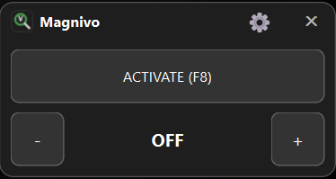
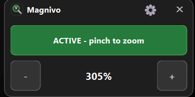
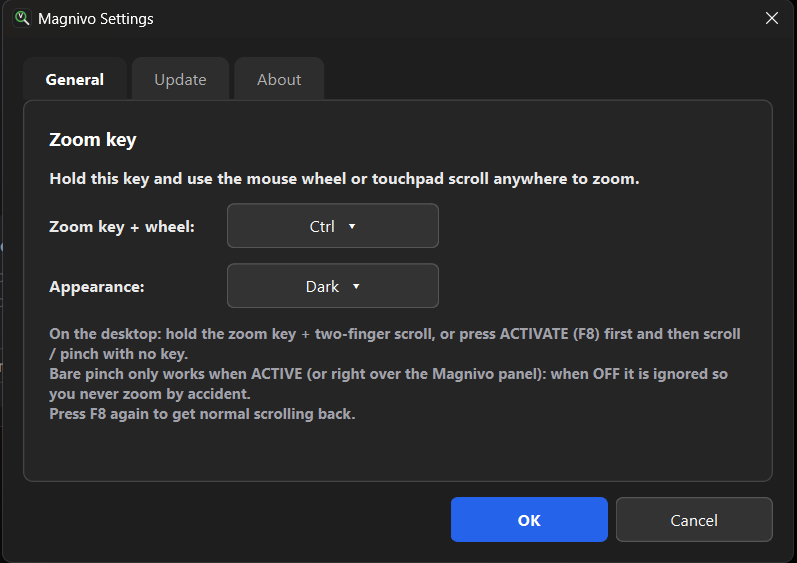
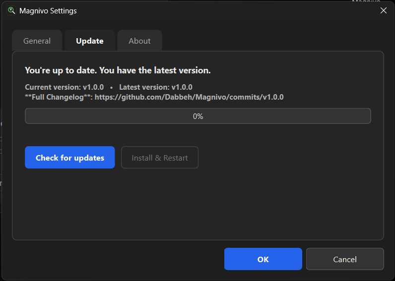
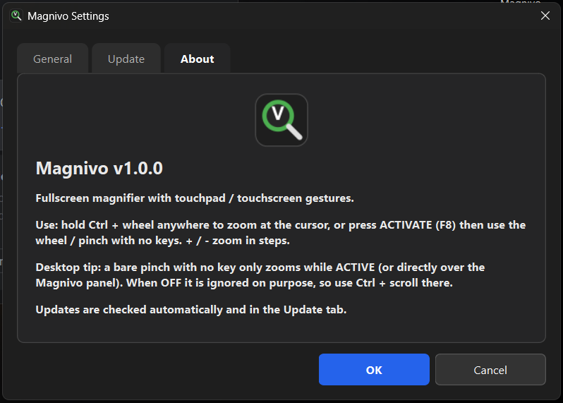

# Magnivo

Lightweight fullscreen screen magnifier for Windows, like the built-in
Windows Magnifier, but controlled with mouse wheel, touchpad scroll and
touchscreen pinch gestures. Zooms the whole desktop (100%–800%) with a
small floating control panel, using the Windows Magnification API
(GPU, no flicker, no screenshots).

## Screenshots


*Floating panel when OFF — press ACTIVATE (F8) to arm gestures.*


*When ACTIVE (green) — wheel / pinch zooms with no key, `+` / `-` step.*


*Settings → General: remappable zoom key + Dark / Light appearance.*


*Settings → Update: automatic check, download with progress, Install & Restart.*


*Settings → About: version, usage and desktop pinch tip.*

## Controls

| Action | What happens |
|---|---|
| `Ctrl+Alt+G` (installed version) | Launch Magnivo, or bring its panel forward if open |
| `Ctrl` + wheel / two-finger scroll (anywhere) | Zoom at the cursor (auto-arms) |
| `ACTIVATE` button, `F8` or `Ctrl+Alt+M` | Arm/disarm gesture mode |
| `Ctrl+Alt++` / `Ctrl+Alt+-` (anywhere) | Zoom in/out in steps (auto-arms, hold to repeat) |
| Wheel / pinch while ACTIVE (green) | Zoom with no key held |
| `+` / `-` buttons | Zoom in steps (auto-arm) |
| Gear icon | Settings: zoom key, dark/light look, updates, about |
| `Esc` / `X` | Close, screen back to normal |

The zoom key (`Ctrl`, `Alt`, `Shift`, `Win`) is remappable in
Settings → General. On the bare desktop, pinch only zooms while ACTIVE
(or directly over the panel) — when OFF it is ignored so you never zoom
by accident.

## Requirements

- Windows 10/11, Qt 6 (Widgets + Network), MinGW, CMake, Ninja
- Optional: Inno Setup 6 (to build the installer)

## Build (release)

```powershell
$env:PATH = "C:\Qt\Tools\Ninja;C:\Qt\Tools\mingw1310_64\bin;C:\Qt\Tools\CMake_64\bin;" + $env:PATH
cmake -S . -B build\rel -G Ninja -DCMAKE_PREFIX_PATH=C:\Qt\6.10.0\mingw_64 -DCMAKE_BUILD_TYPE=Release
cmake --build build\rel
.\build\rel\Magnivo.exe
```

## Installer

```powershell
mkdir deploy
copy build\rel\Magnivo.exe deploy\
C:\Qt\6.10.0\mingw_64\bin\windeployqt.exe --release --no-translations deploy\Magnivo.exe
& "${env:LOCALAPPDATA}\Programs\Inno Setup 6\ISCC.exe" installer\Magnivo.iss
```

Result: `installer\Output\Magnivo-Setup-<version>.exe` (see
`installer\Magnivo.iss` for the icon wiring and details).

## Updates

The app checks its GitHub releases (`Dabbeh/Magnivo`) on start-up and in
Settings → Update. If a newer release with a downloadable file exists,
it asks Update/Cancel, downloads with progress, then offers
Install && Restart. To ship an update: set the new version in
`kMagnivoVersion` (`Magnivo.h`), `Magnivo.rc`, and `MyAppVersion`
(`installer/Magnivo.iss`), commit, then `git tag vX.Y.Z` and push the
tag — the Release workflow builds the installer and attaches it to the
GitHub release automatically.

## Project layout

| File | Purpose |
|---|---|
| `main.cpp` | Entry point, starts the app |
| `Magnivo.h` / `Magnivo.cpp` | All logic: panel, settings, hooks, zoom, updater |
| `CMakeLists.txt` | Build recipe |
| `Magnivo.qrc` | Embeds `assets/logo.png` as `:/logo.png` |
| `Magnivo.rc` | Exe icon + version info |
| `assets/` | `logo.ico` (7 sizes), `logo.png`, `logo.svg` |
| `installer/Magnivo.iss` | Inno Setup installer script |

## License

See [LICENSE](LICENSE).
